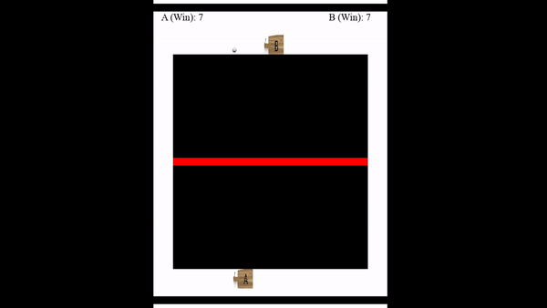

# pytennis-Deep-Q-Network-DQN-
An implementation of a reinforcement learning environment for tennis games using Deep Q Network (DQN)





### Pytennis Environment Description

```

1. There exist 2 agents (2 players) with a ball.

2. There exist a tennis lawn of dimension (x, y) - (500, 550)

3. The ball was designed to move on a straight line, such that agent A decides a target point between x1 (0) and x2 (300) of side B (Agent B side), 
therefore it displays the ball 50 different times with respect to an FPS of 20. This therefore, makes the ball move in a straight line from source 
to destination. This applies respectively to agent B.

4. Movement of AgentA and AgentB are both bound between (x1= 50, to x2 = 550).

5. Movement of the ball is bounded along the y-axis (y1 = 150 to y2 = 700).

6. Movement of the ball is bounded along the x-axis (x1 = 50, to x2 = 550).

```


#### Watch On Youtube

[](https://youtu.be/FCwGNRiq9SY)


### To run program follow the process below:


To clone the work and run the main.py file using the following commands below

``` 
git clone https://github.com/elishatofunmi/pytennis-Deep-Q-Network-DQN-.git

cd "pytennis-Deep-Q-Network-DQN-"

pip install -r requirements.txt

python main.py

```


